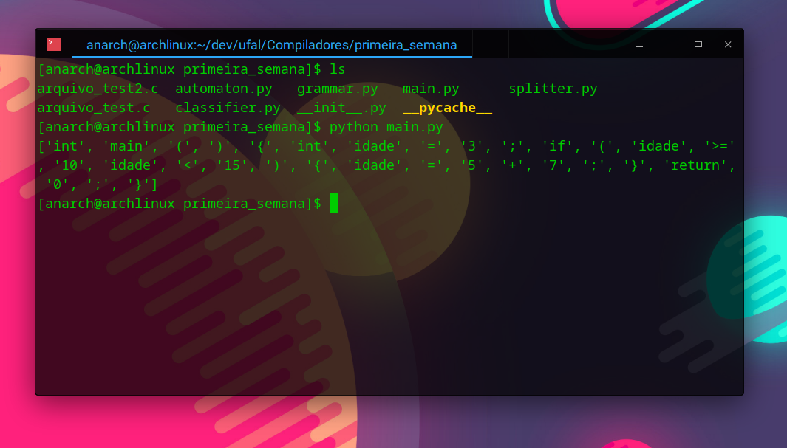

<div align="Center" class="tip" markdown="1" style>




</div>

# BNF - GL

<programa> ::= <rotina> main <corpo> end main

<corpo> ::= <declara> <sentencas>

<declara> ::= <dvar> <declara> | λ

<dvar> ::= define <variaveis> <tipo_var>

<tipo_var> ::= integer

<variaveis> ::= <id> <mais_var>

<mais_var> ::= , <variaveis> | λ

<rotina> ::= <procedimento> | <funcao> | λ

<procedimento> ::= <id> <parametros> <corpo> end <rotina>

<funcao> ::= function <id> <parametros> <tipo_funcao> <corpo> 
	end <rotina>

<parametros> ::= ( <lista_parametros> ) | λ

<lista_parametros> ::= <id> <tipo_var> <cont_lista_par> | λ

<cont_lista_par> ::= , <id> <tipo_var> <cont_lista_par> | λ

<tipo_funcao> ::= integer

<sentencas> ::= <comando> <mais_sentencas>

<mais_sentencas> ::= <sentencas> | λ

<comando> ::= prompt for <id> | display <id> | for <id> = 
	<expressao> to <expressao> <sentencas> end for | while  
	<condicao> <sentencas> end while | if <condicao> then 
	<sentencas> <pfalsa> end if | let <idvar> = <expressao> |
	call <chamada_procedimento>

<chamada_procedimento> ::= <id_proc> <argumentos>

<argumentos> ::= ( <lista_arg> ) | λ

<lista_arg> ::= <expressao> <cont_lista_arg>

<cont_lista_arg> ::= , <lista_arg> | λ

<pfalsa> ::= else <sentencas> | λ

<condicao> ::= <expressao> <relacao> <expressao> 

<relacao> ::= = | <> | >= | <= | > | <

<expressao> ::= <termo> <outros_termos>

<outros_termos> ::= <op_ad> <termo> <outros_termos> |<op_ad> 
	<intnum> <outros_termos> | <id> <outros_termos> | 

<op_ad> ::= + | -

<termo> ::= <fator> <mais_fatores>

<mais_fatores> ::= <op_mul> <fator> <mais_fatores> | λ

<op_mul> ::= * | /

<fator> ::= <id> | <intnum> | (<expressao>) | <id_funcao> 
	<argumentos>

<id> ::= <letra> (<letra> | <digito>)* 

<intnum> ::= <digito>+

<letra> ::= a| b| d| e| ... |w
	
<digito> ::= 0| 1| 2| 3| ... |9

## :warning: Requirements
1- Make sure the following packages are already installed on your system
* `python3`

if they are not already installed you can install them using your package manager for example in arch linux
```bash
sudo pacman -S python
```

## :computer: Execution

Just execute the main.py file with a input file in the same folder:
```bash
python main.py
```

