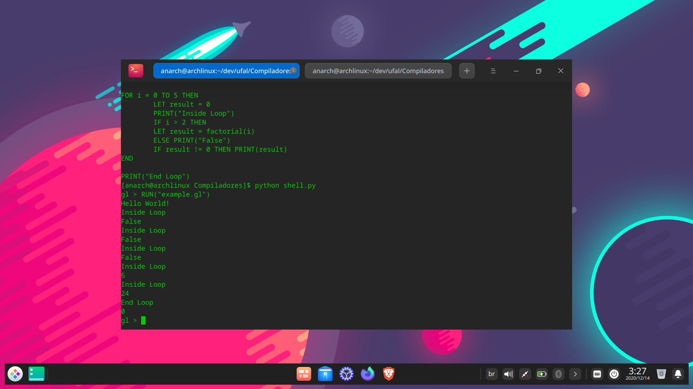

<div align="Center" class="tip" markdown="1" style>




</div>

# BNF - GL
```
<programa> ::= <rotina> <corpo>

<corpo> ::= <declara> <sentencas>

<declara> ::= <dvar> <declara> | λ

<dvar> ::= LET <variaveis>

<variaveis> ::= <id> = <intnum> | <letra> | <string> | <dvar>

<rotina> ::= <procedimento> | <funcao> | λ

<procedimento> ::= <id> <parametros> <corpo> END <rotina>

<funcao> ::= FUNCTION <id> <parametros> <corpo> END <rotina>

<parametros> ::= ( <lista_parametros> ) | λ

<lista_parametros> ::= <id> <cont_lista_par> | λ

<cont_lista_par> ::= , <id> <cont_lista_par> | λ

<sentencas> ::= <comando> <mais_sentencas>

<mais_sentencas> ::= <sentencas> | λ

<comando> ::= PROMPT FOR <id> | PRINT (<id>) | FOR <id> = 
	<expressao> TO <expressao> <sentencas> END | WHILE  
	<condicoes> <sentencas> END | IF <condicoes> THEN 
	<sentencas> <pfalsa> | LET <id> = <expressao> |
	RUN <chamada_programa>

<chamada_programa> ::= ( <letra> )

<argumentos> ::= ( <lista_arg> ) | λ

<lista_arg> ::= <expressao> <cont_lista_arg>

<cont_lista_arg> ::= , <lista_arg> | λ

<pfalsa> ::= ELSE <sentencas> | λ

<condicao> ::= <expressao> <relacao> <expressao> | ( <expressao> <relacao> <expressao> )

<condicoes> ::= <condicao> | <condicao> AND <condicao> | <condicao> OR <condicao>

<relacao> ::= == | <> | >= | <= | > | <

<expressao> ::= <termo> <outros_termos>

<outros_termos> ::= <op_ad> <termo> <outros_termos> |<op_ad> 
	<intnum> <outros_termos> | <id> <outros_termos> | λ

<op_ad> ::= + | -

<termo> ::= <fator> <mais_fatores>

<mais_fatores> ::= <op_mul> <fator> <mais_fatores> | λ

<op_mul> ::= * | /

<fator> ::= <id> | <intnum> | (<expressao>) | <id_funcao> 
	<argumentos>

<id> ::= <letra> (<letra> | <digito>)* 

<intnum> ::= <digito>+

<string> ::= " <char> { <char> } "

<char> ::= <letra> | <digito> | λ

<letra> ::= a| b| c| d| ... y| z| ... A| B| ... Y| Z|

<digito> ::= 0| 1| 2| 3| ... |9
```

## :warning: Requirements
1- Make sure the following packages are already installed on your system
* `python3`

if they are not already installed you can install them using your package manager for example in arch linux
```bash
sudo pacman -S python
```

## :computer: Execution

Just execute the shell.py file with a input file in the same folder:
```bash
python shell.py
```
That will open a prompt that you can run any code accepted by our bnf, to run a example code simply run:
```bash
RUN("example.gl")
```
That will execute the code in the example.gl file

